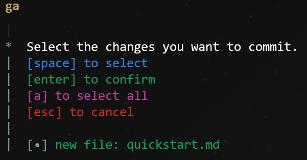
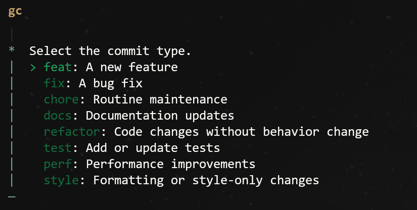

<p align="center">
  <br>
  <br>
  <a href="https://glinter.jannael.com" target="_blank" rel="noopener noreferrer">
    <picture>
      
    </picture>
  </a>
  <br>
  <br>
  <br>
</p>

Glinter is a high-performance, transparent Git wrapper built with **Bun**.

## Preview

<video src="https://github.com/user-attachments/assets/63b401a0-e1e1-453c-9e38-c36cd14e200f" controls="false" autoplay="true" loop="true" muted="true" style="max-width: 100%;">
Your browser does not support the video tag.
</video>

## Features

- **Abbreviation**: You can use `g` instead of `git`.

- **Safe by Default**: Automatically filters and prevents accidental staging of sensitive files: `.env` and `node_modules`.

- **Transparent Wrapper**: For every other command (like `commit`, `push`, `log`, or `status`), Glinter acts as a direct tunnel to Git. It preserves all original colors, formatting, and interactive features of the native Git CLI.


### Commands

| Command | Description |
|---|---|
| `g add` | Opens an interactive file selector to stage changes, filtering out sensitive files like `.env` and `node_modules` |
| `g commit` | Opens an interactive prompt to select a commit type and write a commit message |
| `g switch` | Opens an interactive prompt to switch branches |
| `g setup` | sets up alias for git and glinter |
| `g alias` | shows all the aliases |

### Aliases

| Alias | Command | Description |
|---|---|---|
| gs | git status -sb | Status with short format and branch info |
| gl | git log --oneline --decorate --graph --all -n 20 | Recent commits graph |
| gll | git log --stat | Log with file change statistics |
| gd | git diff --word-diff=color | Word-level diff with colors |
| gds | git diff --staged --word-diff=color | Staged diff with colors |
| ga | glinter add | Interactive staging |
| gaa | git add -A | Add all changes |
| gc | glinter commit | Interactive commit |
| gcm | git commit -m | Direct commit message |
| gca | git commit --amend | Amend last commit |
| gcan | git commit --amend --no-edit | Amend without editing |
| gb | git branch | List branches |
| gba | git branch -a | List all branches |
| gco | glinter switch | Interactive branch switch |
| gcb | git checkout -b | Create and switch branch |
| gpl | git pull | Pull from remote |
| gplr | git pull --rebase | Pull with rebase |
| gp | git push | Push to remote |
| ggpush | git push origin HEAD | Push current branch |
| gpf | git push --force-with-lease | Force push with lease |
| gst | git stash | Stash changes |
| gstp | git stash pop | Pop stash |
| gstl | git stash list | List stashes |
| gcl | git clean -fd | Clean untracked files |
| grh | git reset --hard | Hard reset |

## Quick Start

1. **Install Glinter**:

   ```bash
   npm install -g @jannael/glinter
   ```

2. **Set up aliases** (optional, recommended):

   ```bash
   g setup
   ```

3. **Start using Glinter**:

   ```bash
   g add        # Interactive file staging
   g commit     # Interactive commit
   g status     # Standard git status
   g push       # Standard git push
   ```

   


### Screenshots

| `g add` | `g commit` |
|---|---|
|  |  |


## How it works

Glinter is designed to be as "natural" as possible, meaning it shouldn't feel like a wrapper at all.

### 1. The Transparent Proxy
In `src/index.ts`, Glinter uses `Bun.spawn` with `stdio: 'inherit'`. This is a low-level operation that connects the standard input, output, and error streams of the Git process directly to your terminal. 
- **Result**: Git "knows" it's in a real terminal, so it correctly detects colors and allows for interactive prompts (like credential entry).

### 2. Reliable Status Parsing
For the interactive `add` feature, Glinter runs `git status --porcelain`. 
- **Why?**: Standard `git status` output is designed for humans and can change based on your Git version or system language. `--porcelain` is a machine-readable format that is consistent across all environments, making the file detection 100% reliable.

### 3. Interactive Selection
Using the `@clack/prompts` library, Glinter transforms the raw status data into a selectable list. 
- The selection logic uses Bun's high-speed shell to execute the final `git add` command, correctly escaping filenames to handle spaces and special characters.

## Installation

To use Glinter as your primary Git interface (e.g., using the command `g`):

```bash
npm install -g @jannael/glinter
```

### For Development

1. **Clone the repo**
2. **Install dependencies**: `bun install`
3. **Link the binary**: `bun link`

now you can simply run:
```bash
g add           # Opens the interactive selector
g commit        # Opens commit type + message prompt
g add <file>    # Runs standard git add <file>
g commit -m ""  # Runs standard git commit -m ""
g status        # Runs standard git status
g push          # Runs standard git push
```
