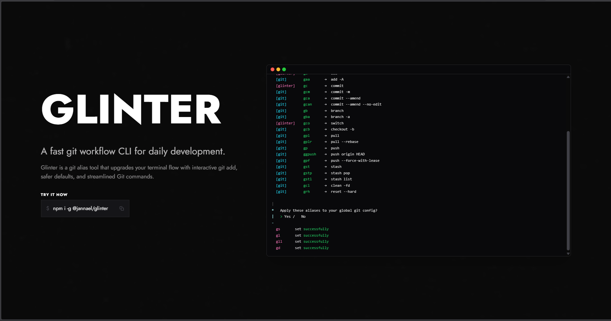

<p align="center">
  <br>
  <br>
  <a href="https://glinter.jannael.com" target="_blank" rel="noopener noreferrer">
    <picture>
      
    </picture>
  </a>
  <br>
  <br>
  <br>
</p>

## 🚀 Project Structure

```text
/
├── public/
├── src/
│   └── pages/
│       └── index.astro
└── package.json
```

## 🧞 Commands

| Command                   | Action                                           |
| :------------------------ | :----------------------------------------------- |
| `bun install`             | Installs dependencies                            |
| `bun dev`             | Starts local dev server at `localhost:4321`      |
| `bun build`           | Build your production site to `./dist/`          |
| `bun preview`         | Preview your build locally, before deploying     |

## 📸 Screenshots

| Glinter Web Preview |
|---|
|  |

## 👀 Want to learn more?

Check out the main [Glinter README](../../README.md) for more information.
